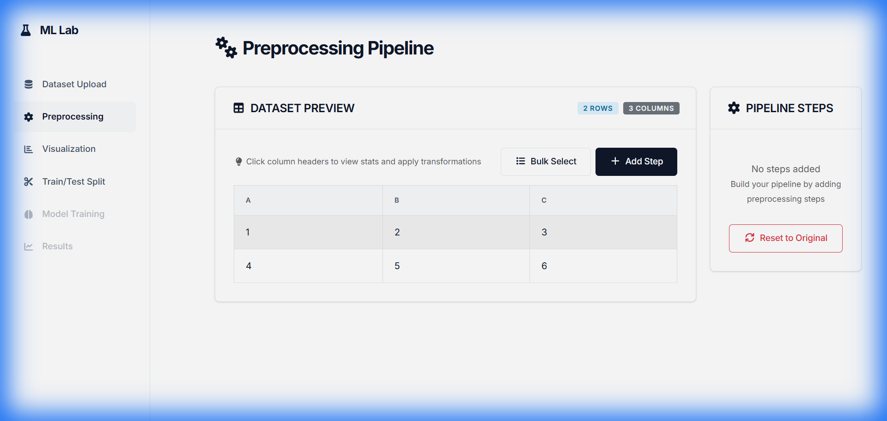

# ML Experimentation Lab

An interactive web-based platform for machine learning experimentation, featuring complete implementations of ML algorithms from scratch, comprehensive data preprocessing, and interactive visualizations.


## Features

### ML Algorithms (Implemented from Scratch & TensorFlow)
- **Naive Bayes** - Probabilistic classifier with Gaussian and categorical support
- **C4.5 Decision Tree** - Information gain ratio with pruning
- **CHAID** - Chi-square Automatic Interaction Detection with category merging
- **K-Nearest Neighbors** - Instance-based learning with configurable 'k' and distance metrics (Euclidean, Manhattan, Minkowski)
- **Neural Network** - Multi-layer Perceptron (MLP) powered by TensorFlow/Keras
- **Convolutional Neural Network (CNN)** - Deep learning model for image classification (e.g., MNIST)

### Data Preprocessing

- **Missing value handling** - Mean, median, mode, forward fill, drop, custom values
- **Categorical encoding** - One-hot encoding, label encoding
- **Feature scaling** - Min-max normalization, Z-score standardization
- **Discretization** - Equal width, equal frequency, custom bins
- **Zeros as missing** - Handle zeros that represent missing values
- **Bulk operations** - Apply preprocessing to multiple columns simultaneously
- **Column-level statistics** - Interactive column information panel

### Visualization Tools
- **Interactive charts** - Bar, line, pie, scatter, box plots, heatmaps
- **Resizable visualizations** - Drag-to-resize chart cards
- **Multiple charts** - Create and compare multiple visualizations side-by-side
- **Real-time updates** - Dynamic chart updates as data changes

### Model Evaluation
- **Confusion matrix** - Interactive heatmap visualization
- **Per-class metrics** - TP, TN, FP, FN for each class
- **Performance metrics** - Precision, Recall, F1-Score, Accuracy
- **Averaged metrics** - Macro, weighted, and micro averages
- **Train/Test comparison** - Side-by-side performance analysis
- **Tree visualization** - For C4.5 and CHAID decision trees

### Additional Features
- **Train/Test split** - With optional stratification
- **Dataset upload** - CSV and ARFF file support (up to 500MB+ with streaming upload)
- **Preview and statistics** - Dataset overview with column stats
- **Clean UI** - Modern "Research Lab" design with FontAwesome icons
- **Responsive layout** - Works on different screen sizes

## Getting Started

### Prerequisites
- Python 3.8+
- Node.js 14+
- npm or yarn

### Installation

1. **Clone the repository**
```bash
git clone https://github.com/yourusername/ml-experimentation-lab.git
cd ml-experimentation-lab
```

2. **Backend Setup**
```bash
cd backend
pip install -r requirements.txt
```

3. **Frontend Setup**
```bash
cd frontend
npm install
```

### Running the Application

1. **Start the Backend Server**
```bash
cd backend
uvicorn app.main:app --reload --host 0.0.0.0 --port 8000
```

2. **Start the Frontend (in a new terminal)**
```bash
cd frontend
npm start
```

3. **Access the Application**
- Frontend: `http://localhost:3000`
- Backend API: `http://localhost:8000`
- API Docs: `http://localhost:8000/docs`

## Project Structure

```
ml-experimentation-lab/
├── assets/                 # Project screenshots
├── backend/
│   ├── app/
│   │   ├── api/
│   │   │   └── endpoints/
│   │   │       ├── datasets.py
│   │   │       ├── preprocessing.py
│   │   │       ├── models.py
│   │   │       └── visualizations.py
│   │   ├── core/
│   │   │   ├── models/
│   │   │   │   ├── naive_bayes.py
│   │   │   │   ├── c45.py
│   │   │   │   ├── chaid.py
│   │   │   │   ├── knn.py
│   │   │   │   ├── neural_network.py (TensorFlow)
│   │   │   │   └── cnn.py (TensorFlow)
│   │   │   ├── preprocessing.py
│   │   │   └── evaluation.py
│   │   └── main.py
│   └── requirements.txt
│
└── frontend/
    ├── src/
    │   ├── components/
    │   │   ├── DatasetUpload.js
    │   │   ├── Preprocessing.js
    │   │   ├── TrainTestSplit.js
    │   │   ├── ModelSelection.js
    │   │   ├── Visualization.js
    │   │   └── Results.js
    │   ├── services/
    │   │   └── api.js
    │   ├── App.js
    │   └── App.css
    └── package.json
```

## Use Cases

- **Educational** - Learn ML algorithms by exploring from-scratch implementations
- **Data Science** - Quick experimentation with different preprocessing techniques
- **Prototyping** - Rapidly test multiple algorithms on your dataset
- **Research** - Compare algorithm performance with detailed metrics

## Technologies

### Backend
- **FastAPI** - Modern Python web framework
- **TensorFlow/Keras** - Deep Learning framework
- **NumPy & Pandas** - Data manipulation and numerical computing
- **SciPy** - Statistical functions (chi-square tests)

### Frontend
- **React** - UI framework
- **Bootstrap** - Component library and styling
- **Plotly.js** - Interactive visualizations
- **Font Awesome** - Icon library
- **Axios** - HTTP client

## Supported Datasets

- CSV files
- Numerical and categorical features
- Binary and multi-class classification
- Datasets with missing values

## Contributing

Contributions are welcome! Please feel free to submit a Pull Request.

1. Fork the project
2. Create your feature branch (`git checkout -b feature/AmazingFeature`)
3. Commit your changes (`git commit -m 'Add some AmazingFeature'`)
4. Push to the branch (`git push origin feature/AmazingFeature`)
5. Open a Pull Request

## License

This project is licensed under the MIT License - see the [LICENSE](LICENSE) file for details.

## Acknowledgments

- ML algorithms implemented following academic papers and textbooks
- UI/UX inspired by modern data science platforms
- Built as a comprehensive data mining educational tool

